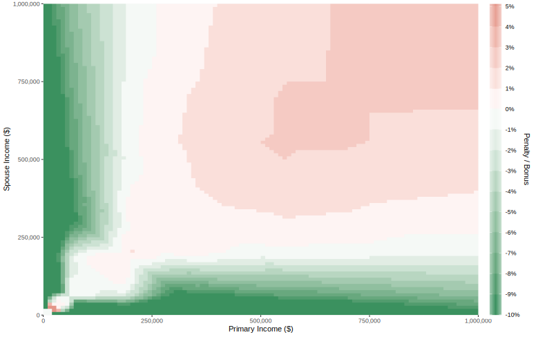
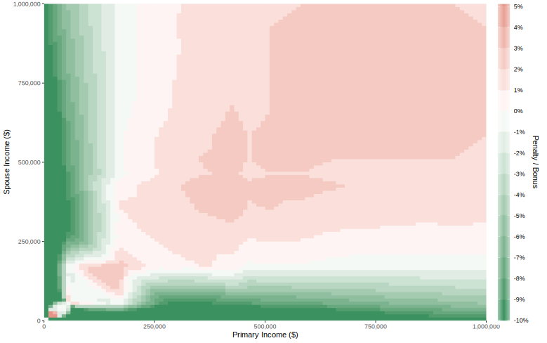

# Graph of the Marriage Bonus / Penalty

by [Andrew Brampton](https://bramp.net)

> [!WARNING]
> **Disclaimer**: None of this is financial advice, just my afternoon of hacking code.

This project uses [tax simulations](https://taxsim.nber.org/taxsim35/) to graph the marriage penalty in the US. The marriage penalty is a phenomenon where married couples pay more in taxes than they would if they were single and filing separately. Sometimes a marriage bonus exists if the income of the two spouses is significantly different.

## Examples

For the 2023 tax year, for a couple living in California, assuming income from wages only, the breakdown is as such:



1. If the primary taxpayer earns $500,000 and the spouse earns $50,000 then there is a tax bonus of ~10%, over the total tax paid if they were not married. 

2. If both spouses earn $250,000 then there is a penality of between 0 and 1% over being unmarried.

3. If both are tech-moguls their penality is 4% or higher over being unmarried.

Another example, for the 2023 tax year, a couple living in California, assuming income from wages with an additional 5% dividends + 5% interest + 5% short-term capital gains + 5% long-term capital gains.




## Create Data

Edit `tax.r` for your needs, and then

```shell
Rscript tax.r

# This will generate penalty.csv and penalty.svg
```


## Pre-generated Data

* [penalty-simple.csv](penalty-simple.csv) Income is 100% from wages, not captain gains, etc.
* [penalty-extra.csv](penalty-extra.csv) Income from wages + additional 5% (dividends, interest, short-term capital gains, long-term capital gains).


## Sources
https://www.investopedia.com/terms/m/marriage-penalty.asp
https://taxsim.nber.org/taxsim35/
https://www.shaneorr.io/r/usincometaxes/
https://www.shaneorr.io/r/usincometaxes/articles/taxsim-output

